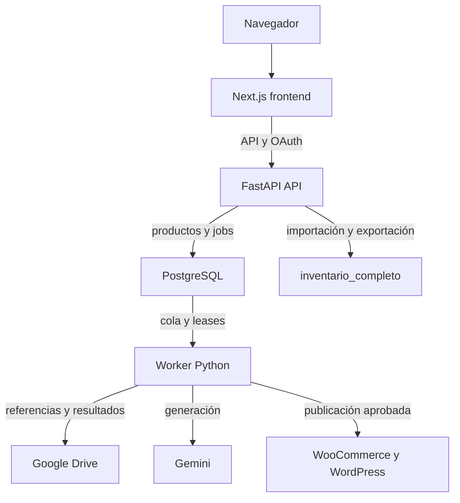

# Arquitectura de la Suite Ecommerce IA

Esta guía describe código verificable del PR #25. La arquitectura preparada y lo que está desplegado son estados distintos. Empieza aquí si conoces Python y aún estás aprendiendo React/FastAPI.

## Qué hace cada parte

| Parte | Lenguaje | Archivo de entrada | Responsabilidad |
| --- | --- | --- | --- |
| Pantallas | TypeScript, React y CSS | `frontend/app/page.tsx` y `frontend/components/CaptureStudio.tsx` | Capturar datos, mostrar imágenes y enviar solicitudes. |
| Servidor HTTP | Python, FastAPI | `service_entrypoint.py`, `studio_api.py`, `catalog_platform/api.py` | Comprobar sesión, permisos, referencias y datos; responder JSON o crear jobs. |
| Generador preservado | Python | `creative_pipeline.py`, `studio_api.make_image` | Plan creativo, modelo Gemini, correcciones y composición de imagen. |
| Adaptador del generador | Python | `image_generation_service.py` | Reutilizar el generador dentro del worker. |
| Worker | Python | `catalog_platform/worker.py` | Ejecutar jobs aunque el navegador se cierre. |
| Persistencia | PostgreSQL, SQLAlchemy | `catalog_platform/models.py`, `database.py`, `queue.py` | Productos, IDs externos, imágenes, trabajos y movimientos. |
| Archivos | Google Drive | `drive_service.py` y funciones históricas de `app.py` | Referencias, imágenes, exportaciones y respaldos. |
| Intercambio de inventario | Google Sheets/archivos | `catalog_platform/imports.py`, `inventory_schema.py`, `app.py` | Importar/exportar; conservar `inventario_completo`. |
| Tienda | REST de WordPress/WooCommerce | `catalog_platform/ecommerce.py`, `woocommerce_*`, `wordpress_media.py` | Publicación explícita y sincronización por IDs permanentes. |

## Arquitectura preparada con tres procesos

Next.js envía `/api/*`, `/login`, `/auth/*` y `/logout` a una API fija mediante rewrites. El navegador conserva el origen del frontend y sus cookies privadas. `APP_PUBLIC_ORIGIN` autoriza ese origen exacto en la API; la comprobación de Host de la API permanece activa.

API y worker comparten PostgreSQL y Drive. No comparten RAM, sesiones ni `/tmp`. El worker reconstruye su contexto desde credenciales cifradas y IDs de Drive. Las sesiones HTTP continúan siendo locales al proceso API: después de reiniciarlo hay que iniciar sesión otra vez; los jobs persistidos permanecen.

## Estado real de Render

La inspección de esta continuación encontró los dos servicios históricos en `agent/woocommerce-inventory-foundation`, sin PostgreSQL ni Key Value. El Blueprint preparado añade tres servicios separados y una base. Todavía requiere activación y validación real; los dos servicios históricos permanecen durante la transición.

El `Dockerfile` compatible sigue exportando Next.js y sirviéndolo desde Python. `Dockerfile.frontend` ejecuta Node; `Dockerfile.api` ejecuta solo la API; `Dockerfile.worker` ejecuta jobs. La selección es explícita, no una migración automática.

## Por dónde leer el código

1. Lee [REQUEST_FLOWS.md](REQUEST_FLOWS.md) para seguir una acción de principio a fin.
2. Lee [IMAGE_GENERATION_FLOW.md](IMAGE_GENERATION_FLOW.md) antes de modificar generación.
3. Abre un handler de `catalog_platform/api.py` y sigue solo las funciones que llama.
4. Revisa [DATA_MODEL.md](DATA_MODEL.md), [DRIVE_AND_SHEETS.md](DRIVE_AND_SHEETS.md) y [GLOSSARY.md](GLOSSARY.md).

Los módulos históricos de `app.py` aún son una dependencia real. Tener una UI React no significa que toda la lógica anterior haya sido reescrita. No se introduce otro framework ni un proveedor de IA nuevo en esta continuación.

## Límites que siguen pendientes

Auditoría formal de seguridad, activación de recursos, OAuth en el dominio separado y prueba real de generación/recuperación en Render. La prueba HTTP del proxy usa un backend local simulado; no sustituye una generación real.
