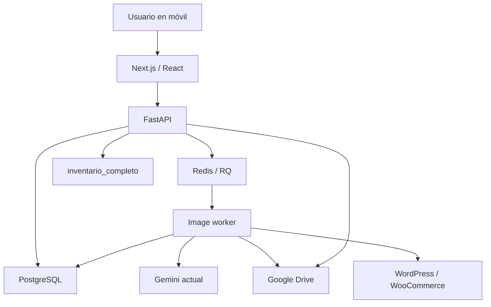

# Cómo funciona Suite Ecommerce IA

Fecha: 2026-10-06. Lectura guiada para mantener este repositorio. Empieza aquí y
continúa por [CODE_MAP](CODE_MAP.md) y [REQUEST_FLOWS](REQUEST_FLOWS.md).

## Dos estados que no debemos confundir

En Render siguen funcionando `suite-ecommerce-ia` y `suite-ecommerce-ia-ai`,
con el commit `41d0599` de `agent/woocommerce-inventory-foundation`. Son dos
servicios web Docker de la aplicación histórica; todavía no ejecutan esta
separación. No se modificaron sus despliegues, variables ni datos en esta auditoría.

La rama `agent/stabilize-architecture-20261006` continúa la plataforma existente
`agent/catalog-platform` (`9dc9a09`). Sus tres servicios separados ya están
desplegados en staging free y mantienen el generador aceptado. El siguiente
diagrama representa ese modo separado: las conexiones están enlazadas, pero
login y operaciones reales todavía requieren el pase de TEST_PLAN. No se cambió
la entrada de producción ni se activaron nuevas escrituras a la tienda.

El detalle de servicios históricos, staging gratuito y comandos está en
[RENDER_SERVICES](RENDER_SERVICES.md). Loyverse sigue siendo una preparación:
no aparece como sincronización operativa en este diagrama.

## Qué hace la interfaz

El navegador ejecuta React, una biblioteca que construye la pantalla a partir
de componentes y datos. Next.js compila y sirve esa interfaz. El componente
`Platform` de `frontend/app/page.tsx` organiza Inicio, Productos, Generar,
Inventario y Más. `frontend/components/CaptureStudio.tsx` conserva el flujo de
capturar un producto, identificarlo, generar y revisar sus imágenes.

En móvil la navegación está abajo; en pantallas amplias cambia a barra lateral.
Los productos se muestran como tarjetas. Los cambios de precio, stock o imágenes
se envían a la API: cambiar un campo en React no modifica por sí solo la tienda.
La pantalla de Inicio muestra datos operativos y la última lectura disponible
de pedidos; POS no muestra ventas inventadas mientras no esté conectado.

Las funciones `api` en `page.tsx` y `CaptureStudio.tsx` envían solicitudes y
tratan sus errores. En despliegue separado,
`frontend/next.config.ts` reenvía `/api/...`, login y callback a FastAPI.
Para el usuario todo ocurre en el dominio del frontend. El proxy conserva
cookies y respuestas; no ejecuta IA, no tiene credenciales Google o WooCommerce
y no abre Drive directamente. `SUITE_API_ORIGIN` es una dirección pública de
la API, nunca una clave. Cambiarla requiere recompilar el frontend.

El manifest, los iconos y `frontend/public/sw.js` preparan la instalación PWA.
El service worker conserva la carcasa pública, no catálogos privados, fotos,
tokens ni respuestas de API. Se muestran conexión, desconexión y reconexión.
No existe todavía una cola de escrituras offline: una operación fallida debe
revisarse antes de repetirse, especialmente si puede gastar dinero.

## Qué es FastAPI aquí

FastAPI recibe solicitudes HTTP y devuelve JSON, archivos o redirecciones.
`service_entrypoint.py` es el punto de arranque. En el rol `main` incorpora la
captura de `studio_api.py`, el catálogo de `catalog_platform/api.py`, webhooks
y herramientas compatibles. `SUITE_SERVE_FRONTEND=false` hace que este servicio
sirva únicamente la API; el Dockerfile histórico aún puede servir la exportación
Next como modalidad de compatibilidad.

Un endpoint es una dirección y una operación concreta. Por ejemplo,
`GET /api/platform/products` consulta productos y
`POST /api/platform/generation/jobs` pide trabajos de generación. Las clases
Pydantic comprueban campos y límites antes de entrar en la operación. Las
dependencias `session` y `context` identifican al usuario y su carpeta.

El login actual utiliza Google OAuth. El navegador guarda un identificador
de sesión en una cookie `HttpOnly`, `Secure` y `SameSite=Lax`; las credenciales
quedan en el servidor. Los permisos efectivos se comprueban allí mediante
`RoleMiddleware`, `member`, `require_role`, `edit` y `admin`. Ocultar un botón
en React no sustituye esos controles. En el nuevo modo se exige allowlist;
`APP_ROLE_MAP` distingue `admin`, `editor` y `viewer`.

Las sesiones y los borradores previos a generar siguen siendo locales al único
proceso API. Reiniciar la API puede exigir volver a iniciar sesión. Eso no borra
jobs: los trabajos e imágenes que ya se entregaron al worker se recuperan
desde PostgreSQL y Drive. No se afirma que una captura aún no enviada sobreviva
al reinicio. Mantener una instancia API es la configuración inicial deliberada;
varias instancias exigirían compartir sesiones y rate limiting de forma durable.

## Qué contiene PostgreSQL

PostgreSQL es la base estructurada del catálogo nuevo y el registro durable de
trabajos. `catalog_platform/models.py` declara productos, variantes, imágenes,
lotes, jobs, assets, movimientos, mappings, eventos y auditoría. SQLAlchemy
traduce operaciones Python a SQL. `database.transaction` confirma un grupo de
cambios completo o lo revierte si hay un error.

Cada producto tiene un UUID interno (`Product.id`), SKU y, cuando existen, IDs
de WooCommerce o Loyverse. El UUID mantiene la identidad aunque cambie un SKU.
Una variante es otro producto asociado al padre. `IntegrationMapping` evita
que toda relación entre plataformas dependa de buscar por nombre o SKU.

Una imagen se representa con ID Drive, checksum, dimensiones, rol y estado.
Sus bytes permanecen en Drive: no hay una columna SQL con fotografías base64.
Las conexiones necesarias para que el worker actúe sin el navegador se cifran
con Fernet en `IntegrationAccount`. API y worker necesitan la misma
`CREDENTIAL_ENCRYPTION_KEY`. Perder esa clave hace ilegibles esas conexiones;
rotarla exige una migración específica y no forma parte de esta actualización.

El esquema se prepara explícitamente con `python -m catalog_platform.migrate`.
No hay migraciones destructivas ni DDL en cada arranque. Esta etapa añade
`GenerationBatch` y una columna nullable `batch_id`. Es una migración inicial
aditiva, no un sistema general de downgrade automático. Consulta
[DATA_MODEL](DATA_MODEL.md) antes de alterar tablas con datos.

## Qué hace Redis y por qué también necesitamos SQL

Redis compatible, llamado Key Value en Render, transporta la cola RQ.
`catalog_platform/redis_broker.py` entrega solamente el ID del job. No serializa
imágenes, tokens ni funciones con pickle; utiliza JSON. El worker consulta ese
ID en SQL para obtener su estado y reclamarlo.

La API primero confirma la fila SQL y después publica en Redis. Esto evita que
el worker vea un job cuya transacción acaba siendo revertida. Si Redis falla
entre ambos pasos, SQL conserva la solicitud aceptada. El supervisor consulta
periódicamente los jobs `queued` y vuelve a entregar sus IDs. Este patrón es
una bandeja de salida durable sencilla, no una plataforma adicional.

El ID de entrega RQ y el bloqueo de despacho impiden duplicar la cola. El
`request_key` identifica la misma intención del usuario, incluso si hubo un
timeout HTTP. Los locks de producto y los advisory locks PostgreSQL controlan
solicitudes concurrentes. La configuración Key Value usa `noeviction` para
no expulsar trabajos cuando falta memoria. El plan gratuito propuesto sirve
para staging; SQL conserva la recuperación aun si se vacía Redis. PostgreSQL
free caduca a los 30 días: mantener Drive/Sheets como fuente operativa y
conectar almacenamiento gratuito persistente autorizado antes de promover SQL.

## Qué hace el worker

El worker es otro proceso, en otro servicio y con su propia RAM. Su comando es
`python -m catalog_platform.worker_web` en el Blueprint gratis. Abre únicamente
un health HTTP liviano en PORT y ejecuta el supervisor en el hilo principal.
El comando sin HTTP `python -m catalog_platform.worker` sigue disponible para
desarrollo u otro alojamiento. Con `GENERATION_QUEUE_BACKEND=rq`, arranca
el supervisor `redis_worker.main`, un pool RQ y un reconciliador. El heartbeat
SQL informa a la API de que existe un worker reciente. En web free, la API
puede aceptar un job SQL mientras el worker duerme y mandar una petición HTTP
al health público para despertarlo. El origen debe ser HTTPS onrender.com y no
se siguen redirects ni se envían secretos. Un solo hilo daemon agrupa wakeups.
El status diferencia heartbeat real de capacidad de aceptar trabajos; el HTTP
no ejecuta IA. Sin ese origen configurado, se conserva el rechazo cuando
Redis/worker no están listos. Una lectura sin trabajos no despierta el worker.

`IMAGE_WORKER_CONCURRENCY=1` empieza con un job simultáneo. RQ ejecuta cada
trabajo en un proceso hijo; al finalizar libera su memoria. No se asume que
ocho threads mejoran el rendimiento. El límite permitido es 1–8, pero subirlo
requiere medir RAM, conexiones y gasto. El contenedor limita también los
threads de bibliotecas numéricas. Un OOM del worker no termina Next ni FastAPI.

Un lote crea una fila `GenerationBatch` y un `GenerationJob` por producto.
Cada uno guarda sus slots terminados. Si el producto 3 falla, los resultados
de los productos 1 y 2 permanecen. Los estados son `queued`, `processing`,
`completed` o `failed`; la revisión puede llevarlos a `approved`, `rejected`
o `published`. La captura compatible llama al estado activo `running` en su
respuesta para conservar el contrato del componente existente.

El lease es la reserva temporal del job por su worker; se renueva mientras
hay llamadas externas. Antes de una llamada pagada o escritura se guarda
`in_flight`. Si el proceso muere con resultado desconocido, el job falla con
aviso de incertidumbre. No vuelve a llamar automáticamente a Gemini. Esto
protege el dinero y exige revisar qué archivo o resultado ya existe.

## El generador que preservamos

El worker reutiliza `ImageGenerationService`, que llama a las funciones
aceptadas `studio_api.creative_plan` y `studio_api.make_image`. Estas llaman a
`creative_pipeline.py` y al gateway Gemini. No se cambiaron sus prompts,
referencias, investigación, reglas de producto limpio/lifestyle/comercial,
modelo, marca ni QA. Un contrato AST los compara con un commit inmutable;
las regresiones de comportamiento comprueban JPEG válido, dimensiones,
relación con producto, naming, correcciones, errores y guardado.

En catálogo el worker usa `worker.generation`; en captura individual usa
`studio_jobs.process_capture`. Ambos descargan sus propias referencias a `/tmp`
y suben candidatos a `imagenes_temporales/<job_id>`. El naming conserva
`<SKU>_1_hd.jpg`, `_2_uso.jpg`, `_3_comercial.jpg`. Los históricos `.png`
siguen siendo reconocidos. No se mueven originales ni se modifica la carpeta
generada antes de revisión.

La captura mantiene su guardado probado con `ProductCapture.save`. El catálogo
añade un guardado explícito de un asset aprobado; si existe el mismo nombre,
`DriveService.save_approved` respalda el archivo antes de actualizar su contenido
conservando el ID. Duplicados de nombre bloquean la operación. Publicar en
WordPress/WooCommerce es otro botón y otro job. Lee
[IMAGE_GENERATION_FLOW](IMAGE_GENERATION_FLOW.md) antes de tocar cualquiera de
estas partes.

## Drive, Sheets y el catálogo durante la transición

La raíz real es `Proyecto_IA`. Sus carpetas críticas son `imagenes_generadas`
y `imagenes_temporales`. `inventario_completo` es un Google Sheet nativo;
`Lista completa` es la pestaña principal y también existen las pestañas de
variantes, productos simples y logs que documenta [DRIVE_AND_SHEETS](DRIVE_AND_SHEETS.md).
No se inventó una reorganización ni se migraron archivos Excel antiguos.

`DriveService` y `SheetsService` encapsulan operaciones nuevas y delegan el SDK
para mantener compatibilidad con módulos probados. Eso no significa que se
reescribieron todas las llamadas históricas. El Sheet conserva su estructura,
columnas vacías incluidas. El nuevo helper escribe una celda concreta, valida
SKU, encabezados y valor previo; Sheets no ofrece una transacción compartida
con PostgreSQL y una edición humana concurrente necesita revisión.

Hoy coexisten captura/operación histórica en Sheet y catálogo SQL preparado.
Las importaciones son explícitas, con respaldo y revisión. Las fichas nuevas
en SQL no se escriben automáticamente al Sheet, ni el arranque declara SQL
autoridad de todo el inventario. Elegir una fuente central requiere conciliar
ambas y completar pruebas reales. La futura fase de BD como fuente única no
se ejecutó en esta actualización.

## Ecommerce y POS

`WooCommerceService` y `WordPressMediaService` envuelven los clientes existentes.
WordPress conserva medios y URLs; WooCommerce recibe IDs de medios y productos.
Las escrituras están bloqueadas por flags hasta probar un producto eliminable.
Los webhooks WooCommerce verifican HMAC, registran el evento cifrado, deduplican
y encolan el procesamiento. El pedido leído no descuenta stock una segunda vez;
la app reconcilia snapshots y movimientos según la autoridad configurada.

`POSProvider` y `LoyverseProvider` preparan lectura de items, variantes, tiendas,
inventario y recibos. El webhook nuevo y las escrituras Loyverse permanecen
inactivos. Cuando se autorice, Loyverse será autoridad del stock físico; antes
hay que validar OAuth, firma, eventos y compensaciones. No se usa un protocolo
de firma supuesto. Consulta [LOYVERSE_FUTURE](LOYVERSE_FUTURE.md).

## Cómo mantenerlo sin perder control

Antes de un cambio, sigue el endpoint hasta su función y su servicio con
`rg`; consulta el mapa de archivos. Si modifica IA, ejecuta primero el contrato
del generador. Si modifica datos, identifica qué tablas/rangos/IDs toca y cómo
revertirlos. No actualices dependencias en bloque durante un cambio de arquitectura.

El resultado verificable de esta etapa es código aislado en una rama, pruebas
automáticas y una propuesta aditiva de despliegue. La disponibilidad real de
Gemini, la escritura en Drive y WooCommerce y la RAM de producción se validan
en el orden de [TEST_PLAN](../TEST_PLAN.md). Si falla generación real en pasos
5–9, se detiene la ampliación. Los dos servicios antiguos siguen disponibles
hasta aprobar ese pase; [ROLLBACK](ROLLBACK.md) explica cómo volver y conservar
resultados nuevos.
