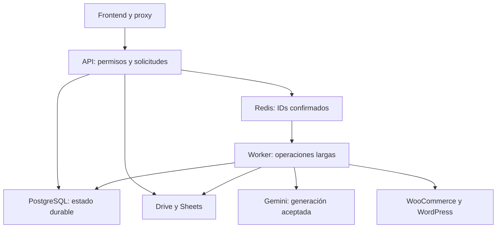

# Guía del código y de reparación

Actualizada el 10 de octubre de 2026. Rama de trabajo:
`feature/woocommerce-and-product-removal-20261009`. Base funcional documentada:
`ba19067b096d36807a4ca77e7d4d6b7abec704be`.

Esta guía explica dónde empieza cada operación y qué debe conservarse al
corregirla. El [índice de funciones y objetos](FUNCTION_INDEX.md) enumera las
definiciones propias de Python y los componentes, tipos y funciones nombrados
del frontend. Incluye ubicación, responsabilidad, rutas y campos declarados de
los objetos. Las dependencias instaladas, callbacks anónimos y variables locales
no son módulos de negocio ni se presentan como funciones independientes.

Los comentarios de esta entrega explican el código; no cambian instrucciones,
prompts, modelos, credenciales, esquema SQL ni datos. Una explicación de una
función histórica no significa que haya que activarla o sustituir la actual.

## Cómo indicar una reparación

Primero busca el síntoma en la tabla de diagnóstico. Copia el archivo y el nombre
de función junto con el paso exacto que falla. El nombre es más estable que el
número de línea, que cambia al añadir comentarios.

```text
Falla: [pantalla/botón/paso y mensaje exacto].
Momento: [fecha, hora, zona horaria y móvil/navegador].
Referencia de la guía: [archivo.py::función / Componente.función].
Resultado esperado: [qué debería ocurrir].
Conservar: [sesión / códigos de barras / generación / Drive / stock].
Investiga el servicio indicado y compara con ba19067 antes de modificar.
Haz un cambio acotado, ejecuta sus pruebas y registra commit y reversión.
```

Ejemplo: «Al tocar Conectar Google se queda Iniciando servidor. Revisa
`frontend/lib/session-recovery.ts::recoverSession` y
`catalog_platform/web_sessions.py::restore`; conserva los SKU y el generador».
Esto señala el recorrido a investigar; no demuestra de antemano cuál es la causa.

## Qué servicios hacen el trabajo

| Servicio | Responsabilidad | Entrada / código |
| --- | --- | --- |
| `rincon-frontend` | Pantallas, confirmaciones y proxy HTTP bajo el dominio que usa el móvil | `frontend/app/page.tsx::Platform`, `frontend/next.config.ts` |
| `rincon-catalog-api` | Login/cookie, permisos, catálogo y aceptación durable de trabajos | `service_entrypoint.py`, `studio_api.py`, `catalog_platform/api.py` |
| `rincon-catalog-worker` | Operaciones largas de imágenes, consulta/publicación e inventario | `catalog_platform/worker_web.py::main` → `redis_worker.main` → `worker.execute_job` |
| PostgreSQL | Estado durable de productos, trabajos, conexiones cifradas y auditoría | `models.py`, `database.py` |
| Redis / RQ | Entrega del ID de trabajo; SQL conserva el estado autorizado | `redis_broker.py`, `rq_settings.py` |
| Google Drive / Sheets | Fotos y el inventario histórico conectado | `drive_service.py`, `sheets_service.py`, `product_capture.py` |
| WooCommerce / WordPress | Tienda y medios externos, con controles de escritura separados | `ecommerce_services.py`, `woocommerce_client.py`, `wordpress_media.py` |

Frontend: `https://rincon-frontend.onrender.com`. API:
`https://rincon-catalog-api.onrender.com`. Worker:
`https://rincon-catalog-worker.onrender.com`.

Los tres servicios nuevos siguen la rama de trabajo. Los servicios históricos
`suite-ecommerce-ia` y `suite-ecommerce-ia-ai` conservan su propia rama/versionado;
no se deben redeplegar al corregir estos tres. El Blueprint vive en
`deploy/render-platform.yaml`; su sincronización puede reconciliar configuración
manual de Render. Antes de desplegar, comprobar rama, commit y variables de cada
servicio, no solo el estado «live».



## Diccionario de objetos

Una **clase** define la estructura/comportamiento. Un **objeto** es un valor de
esa clase. Un **tipo TypeScript** describe datos del navegador; no es una tabla
ni controla permisos. Un **endpoint** es método HTTP + ruta. Una **función**
ejecuta una tarea. Un **adaptador** traduce entre contratos existentes sin
reescribir el sistema que ya funciona.

### Los productos no son el mismo objeto en todas las capas

| Objeto | Archivo | Qué representa / dónde corregir |
| --- | --- | --- |
| `models.Product` | `catalog_platform/models.py` | Ficha durable SQL con UUID, SKU, código, familia, stock, IDs remotos y versión |
| `api.ProductInput` | `catalog_platform/api.py` | Validación de un formulario que va a escribir esa ficha SQL |
| `studio_api.Product` | `studio_api.py` | Ficha validada del borrador compatible de captura; traduce campos históricos |
| `page.tsx::Product` | `frontend/app/page.tsx` | Forma JSON de la ficha SQL mostrada en Productos |
| `CaptureStudio.tsx::Product` | `frontend/components/CaptureStudio.tsx` | Forma del producto que aún se está capturando/revisando |
| `Draft` / `current` | `CaptureStudio.tsx`, `studio_api.py` | Producto, fotos, contexto, brief, candidatos y aprobación de una captura |
| `runtime.SESSIONS` / `value` | `app.py` | Caché de sesiones del proceso; PostgreSQL permite restaurarla tras reinicio |
| `db` | `catalog_platform/database.py::transaction` | Sesión SQL limitada a una transacción; no es la cookie del navegador |
| `drive` | `drive_service.py::DriveService` | Cliente con límite de carpeta; no es un listado global del Drive |
| `router` | `catalog_platform/api.py` | Registro de endpoints bajo `/api/platform`, no un proceso de trabajo |

### Objetos SQL de la plataforma

| Clase | Para qué sirve | Regla que se conserva |
| --- | --- | --- |
| `Base`, `Record` | Tablas declarativas; UUID, tenant y fecha compartidos | Tenant limita el catálogo a su carpeta/tienda |
| `Product` | Producto simple, padre o variante | UUID es identidad; SKU puede cambiar; `version` evita sobrescribir otro cambio |
| `ProductVariant` | Relación entre padre/hijo y sus atributos | No unir familias por parecido de nombre sin revisión |
| `ProductImage` | ID Drive, rol, checksum, dimensiones y metadata | Bytes de fotos permanecen en Drive |
| `Category`, `Brand` | Entidades SQL de categoría/marca | Las opciones actuales de captura se leen de Drive, no de esta tabla por sí sola |
| `InventoryMovement` | Evento y cantidades antes/después | Un mismo evento no se aplica dos veces |
| `GenerationBatch` | Selección confirmada, conteo de imágenes y coste estimado | Un lote agrupa trabajos; no es una llamada Gemini única |
| `GenerationJob` | Tipo de tarea, actor, payload, progreso, lease y estado | Una entrega Redis no reemplaza su estado SQL |
| `GeneratedAsset` | Candidato de un slot/muestra con raw, revisión e historial | Regenerar/corregir conserva el candidato anterior |
| `IntegrationAccount` | Conexión cifrada por tenant/proveedor/actor | No devolver credenciales al frontend ni copiarlas a documentación |
| `IntegrationMapping` | UUID interno vinculado a ID externo | Resolver padre/variante por identidad; no elegir un SKU ambiguo |
| `SyncEvent` | Origen, destino, resultado e ID de trabajo | Consulta y escritura deben distinguirse en el historial |
| `WebhookEvent` | Evento firmado, deduplicado y con payload cifrado | No procesar un evento sin firma ni reactivar un eliminado |
| `AuditLog` | Actor y valores antes/después | Conservar historial para conciliar cambios y retiradas |
| `WorkerHeartbeat` | Supervisor activo, instante y versión | Un health frontend 200 no prueba que el worker esté consumiendo |
| `OrderSnapshot` | Última copia leída de un pedido | Métricas usan pedidos reales; la lectura no modifica la tienda |

Los campos exactos de cada clase y cada contrato Pydantic están en el índice.
Los campos heredados de `Record` se explican una vez y aplican a sus subclases.

### Campos que conviene nombrar al informar un error

| Campo | Significado y protección |
| --- | --- |
| `id` / `product_id` | UUID SQL del registro; no es el código de barras ni el ID WooCommerce |
| `tenant_id` / `platform_tenant` | Carpeta/tienda autorizada; evita cruces de datos entre clientes |
| `sku` / `barcode` | SKU operativo y código físico validado; una máscara de padre no es un GTIN |
| `parent_id` / `parent_sku` | Relación UUID en SQL o referencia histórica de familia en captura/Sheets |
| `version` | Número de edición; una respuesta 409 puede indicar que otro cambio ocurrió antes |
| `actor` | Usuario que pidió la operación; determina cancelación propia y auditoría |
| `request_key` | Identidad de una intención; repetir con la misma clave permite resolver una respuesta perdida sin duplicar |
| `payload` | Snapshot e información recuperable del trabajo; no es autorización para repetir toda la tarea |
| `in_flight` | Operación externa iniciada cuyo resultado puede ser incierto después de un reinicio |
| `lease_owner`, `lease_until` | Worker propietario y vencimiento de la reserva del trabajo |
| `drive_file_id`, `raw_drive_file_id` | Archivos identificados por Drive; no renombrar/mover al corregir una pantalla |
| `status`, `sync_status` | Estado de ficha/revisión/trabajo y de sincronización; pertenecen a contratos distintos |
| `encrypted_credentials` | Conexión cifrada en servidor; no registrar contenido ni cambiar la clave de cifrado |
| `file_namespace` | Espacio privado de temporales de una sesión/trabajo |

## Recorridos y puntos de modificación

### Google, espera y recuperación de sesión

1. Next sirve `/login` como pantalla local `ConnectGoogle`, no como login directo
   de FastAPI. `bootstrap` ejecuta recuperación aun si React no hidrata.
2. `recoverSession` avisa una vez al health público API sin credenciales. La
   readiness se verifica por el proxy con GET `/service-health` y
   `/api/session?auth_only=true`: no se confía en la respuesta opaca directa.
3. Con sesión vigente vuelve a `/`. Sin sesión confirmada navega a `/auth/start`,
   que Next reenvía a `app.login` en FastAPI.
4. `issue_oauth` guarda estado/PKCE; Google vuelve a `/auth/callback` del
   **frontend**. `auth_callback` consume ese estado una vez y valida la cuenta.
5. La cookie es HttpOnly, Secure y SameSite=Lax. `web_sessions.save` guarda la
   sesión cifrada; `restore` recupera una sesión vigente después del arranque.
6. La espera tiene máximo de tres minutos y reintento visible. Un 503 temporal
   de SQL no debe borrar cookie ni convertirse en un 401 de cuenta cerrada.

**Límite real:** las sesiones web se conservan en SQL; el estado OAuth pendiente
continúa en memoria de un único proceso y vence a los diez minutos. Si la API
reinicia entre salida a Google y callback, se debe iniciar un intento nuevo; no
reutilizar el código/state anterior. Esta documentación no añade un almacén
OAuth nuevo ni promete acceso después de la caducidad de la sesión.

Variables a comprobar por nombre, presencia y origen, sin publicar secretos:
`SUITE_API_ORIGIN`, `APP_PUBLIC_ORIGIN`, `GOOGLE_REDIRECT_URI`,
`GOOGLE_REDIRECT_BASE`, `DATABASE_URL`, `CREDENTIAL_ENCRYPTION_KEY`,
`APP_ALLOWED_EMAILS`, `APP_ROLE_MAP`. Cambiar el origen Next requiere recompilar.
Detalles: [sesiones](SESSION_RECOVERY.md) y
[regresión de login/clasificación](AUTH_AND_DRIVE_REGRESSION_REVIEW.md).

### Código de barras, SKU y familias

`studio_api.update_product` y el análisis usan `catalog_capture.barcode` para
validar el código. Se conservan ceros iniciales y dígito de control. El SKU de
captura adopta el código válido; sin lectura válida usa
`app.generar_sku_logica`: marca 3 + nombre 3 + gramaje 4 = diez caracteres.

`barcode_key` normaliza representaciones del mismo GTIN solo para coincidencias.
`next_parent_sku` usa el prefijo de variantes distintas de la misma familia y
enmascara el resto con `x`; sin variantes usa los primeros seis dígitos. Un padre
existente elegido conserva su SKU. Sin código válido se mantiene el respaldo
histórico FULL. Las colisiones requieren revisión.

Estas reglas automáticas pertenecen a **captura**. El formulario SQL validado
por `ProductInput` tiene su propio contrato; no afirmar que cualquier importación
reescribe todos los SKU históricos. No migrar ni renombrar todo el inventario para
corregir una lectura de código. [Reglas y ejemplos](BARCODE_SKU_AND_SOUNDS.md).

### Categorías, subcategorías y etiquetas de Drive

`DriveClassification` pide `/api/catalog-taxonomy` a
`studio_api.catalog_taxonomy`. `catalog_taxonomy.read_rows` busca una hoja
existente y `choices_from_rows` obtiene categorías, subcategorías por categoría
y etiquetas. La búsqueda filtra etiquetas existentes; no las crea.

Cambiar categoría limpia una subcategoría incompatible. Las opciones respetan
el texto de Drive. Defaults solo cubren ausencia de datos, y los errores de
lectura se muestran con reintento. No sustituir este lector por
`app._preparar_estructura`: ese adaptador puede crear/sincronizar hojas/carpetas.

### Imágenes: pedir, ejecutar, revisar y guardar

Hay dos entradas con el mismo generador:

- Captura: `CaptureStudio.run` → `studio_api.generate_images` →
  `studio_jobs.enqueue_capture` → `worker.process` → `process_capture`.
- Catálogo/lotes: `Platform.batch` → `api.enqueue` → `worker.execute_job` →
  `worker.generation`.

`ImageGenerationService` delega a `studio_api.creative_plan` y `make_image`, que
utilizan `creative_pipeline` y `gemini_gateway`. La cola se puede reparar sin
alterar el generador. Cada candidato queda identificado en SQL/Drive.
**Aprobar**, **guardar en Drive** y **publicar en WooCommerce** son operaciones
diferentes, con confirmación y permisos propios.

Los sonidos se controlan con `GenerationSounds`: desbloqueo por gesto, inicio,
éxito/fallo y deduplicación por job. Un sonido bloqueado por el navegador no debe
interrumpir una generación. [Flujo protegido](IMAGE_GENERATION_FLOW.md).

### Trabajos en cola y Detener proceso

`queue.dispatch` registra entrega; `database.transaction` confirma SQL antes de
notificar Redis/despertar worker. `redis_broker.reconcile` recupera una entrega
faltante. `queue.claim` reserva un job; `renew` mantiene lease y `checkpoint`
guarda resultados y comprueba cancelación antes del siguiente paso.

| Estado | Significado | Qué debe conservar una corrección |
| --- | --- | --- |
| `queued` | Aceptado en SQL, aún no reclamado | Detener no depende de Redis ni de que despierte el worker |
| `processing` | Lo ejecuta un propietario con lease | No lanzar un segundo worker sobre la misma operación |
| `cancelling` | Cancelación pedida mientras termina la operación actual | Mantener lease, guardar ese resultado y no iniciar el siguiente paso |
| `cancelled` | Usuario detuvo el trabajo | No reencolar al reiniciar ni mostrarlo como fallo de proveedor |
| `completed` | Operación finalizada | Conservar resultados y coste registrado |
| `failed` | Fallo o resultado incierto | Revisar `in_flight`/archivos/tienda antes de autorizar otro intento |
| `approved`, `rejected`, `published` | Estados adicionales del flujo de revisión/publicación | No confundir revisión de asset con cancelación del job |

La captura traduce `processing` a `running` para su contrato compatible.
`Platform.stopJobs` envía los IDs que se confirmaron; Detener todos no incluye
trabajos creados posteriormente. API aplica tenant/rol/actor y locks.
`JobCancelled` es control de flujo, no error de IA.
[Controles y reversión](CATALOG_CONTROLS.md).

### Eliminar producto

`Platform.deleteProduct` confirma y envía UUID/version a `api.delete_product`.
El servidor exige admin, bloquea la ficha, rechaza padres con variantes vivas o
trabajos en ejecución y cancela los pendientes. Marca `deleted`, conserva datos
e historial y guarda el SKU original en auditoría antes de liberar ese SKU.

La retirada oculta la ficha en listas, métricas/exportaciones y consultas de
activos. La lectura WooCommerce no debe resucitarla. No elimina Drive,
`inventario_completo` ni el producto remoto. Restaurar una ficha exige conciliar
auditoría y posible reutilización del SKU; no basta con quitar el filtro.

### WooCommerce, publicación y stock

`api.ecommerce_refresh` encola una **consulta**; `ecommerce.refresh` lee páginas,
productos/pedidos y snapshots. Importar catálogo es otra acción, con respaldo.
`api.publish` → `worker.publication` usa la ficha/imágenes revisadas y los IDs
remotos. `inventory.sync_stock` valida identidad y cantidad remota previa, envía
una escritura identificada y vuelve a comprobar el resultado.

`SUITE_DRIVE_ONLY=false` habilita la conexión de tienda.
`WC_WRITE_ENABLED=true` autoriza escrituras WooCommerce.
`WP_MEDIA_WRITE_ENABLED` controla **medios WordPress por separado**: activar
WooCommerce no lo activa. `STOCK_AUTHORITY` decide quién puede enviar cantidades.
Un timeout de escritura obliga a consultar el objeto/evento remoto antes de
repetir. [Conexión y pruebas manuales](WOOCOMMERCE.md).

## Diagnóstico: qué decir y qué revisar primero

| Síntoma | Archivo / función inicial | Servicio / evidencia | Conservar / prueba relevante |
| --- | --- | --- | --- |
| Iniciando servidor no termina | `session-recovery.ts::recoverSession`, `connect-google/page.tsx::bootstrap` | Frontend y API: health, tiempos, red/chunks y versión | GET acotados y botón Reintentar; `test_oauth_wakeup.cjs`, `test_frontend_proxy.cjs` |
| Google vuelve pero no hay sesión | `app.auth_callback`, `oauth_guard.consume_oauth`, `web_sessions.restore` | API: callback/frontend origin, cookie, reinicio entre state y callback | PKCE, cookie segura, caducidad; `test_web_sessions.py` |
| Pierde sesión tras inactividad | `web_sessions.save/restore`, `SecurityMiddleware.__call__` | API/SQL: session_backend, cifrado y 503 frente a 401 | No ampliar vigencia ni borrar cookie en fallo temporal; sesiones/proxy |
| Clave Gemini inválida o desaparece | `studio_api.settings`, `accounts.save_gemini/restore/load` | API/worker: clave personal presente y conexión vigente, sin mostrar valor | No fallback a clave global ni cambiar modelo; `test_store_connection.py`, `test_studio_api.py` |
| SKU/código/padre incorrecto | `catalog_capture.barcode/barcode_key/next_parent_sku`, `studio_api.update_product` | API: código legible, ceros iniciales, variantes reales y colisión | Respaldo 10 caracteres y máscara padre; `test_catalog_capture.py`, `test_capture_workflow.py` |
| Clasificación pide escribir a mano | `DriveClassification`, `catalog_taxonomy.read_rows/choices_from_rows` | Frontend/API: `/api/catalog-taxonomy`, carpeta y error de lectura | Lectura sin creación, vocabulario Drive; `test_capture_workflow.py`, `test_capture_mobile.cjs` |
| Trabajo siempre En cola | `worker_wakeup.notify`, `redis_broker.reconcile`, `redis_worker.main`, `queue.claim` | API/worker/Redis: job SQL, wakeup, heartbeat, ramas/versiones | No repetir Gemini para probar cola; `test_free_render.py`, `test_catalog_platform.py` |
| Detener no aparece/no termina | `Platform.stopJobs`, `api.cancel_job/cancel_jobs`, `queue.checkpoint/renew` | Rol/actor, estado SQL y operación externa vigente | No matar la llamada incierta ni reencolar Cancelado; `test_catalog_controls.py` |
| Eliminar falta o da conflicto | `Platform.deleteProduct`, `api.delete_product`, `catalog.product_for` | Frontend/API: versión, admin, familia y jobs activos | Retirada solo app, auditoría, filtros; controles y móvil |
| Una imagen falla o pierde referencia | `worker.generation`, `studio_jobs.process_capture`, `DriveService.download_to` | Worker: slot, job, referencias y checkpoint anterior | Antes de tocar prompts verificar transporte/archivo; contrato y `test_generation_content.py` |
| Lifestyle/comercial/calidad distintos | `studio_api.make_image/creative_plan`, `creative_pipeline` | Comparar con contrato aceptado y referencias de ese producto | Área protegida: cambio solo si se pide; `test_generation_contract.py`, `test_creative_pipeline.py` |
| Sonido repetido o ausente | `GenerationSounds.unlock/observe` y uso en `CaptureStudio` | Navegador: gesto, mute, job y transición | Audio opcional sin llamadas extra; `test_generation_sounds.cjs` |
| WooCommerce no conecta | `store_connection`, `WooCommerceClient.request`, `api.ecommerce_refresh` | API/worker: flags, origen de tienda, tenant e identidad | Conservar credenciales/IDs; `test_store_connection.py` y consulta manual |
| Subida de medios deshabilitada | `WordPressMediaClient._request/upload_media`, `worker.publication` | Worker: WP_MEDIA_WRITE_ENABLED y error de medios | Es distinto de WC_WRITE_ENABLED; no autorizar escrituras por una corrección de lectura |
| Stock no coincide/409 | `catalog.move_stock`, `inventory.sync_stock`, `WooCommerceService.resolve` | Versión, ID padre/variante, cantidad remota y evento | No sobrescribir cambios ajenos ni repetir timeout; `test_variation_stock.py`, catálogo |
| Cambiar ficha sobrescribe otro cambio | `catalog.save_product`, `api.update_product` | UUID, version enviada y AuditLog | Mantener bloqueo/versionado; `test_catalog_platform.py` |
| Imagen/guardado duplicado tras timeout | `Platform.durablePost`, `studio_jobs.enqueue_capture`, `capture_bridge.recover_saved` | request_key, checksum, job y resultado confirmado | Misma intención/idempotencia; `test_frontend_mobile.cjs`, `test_capture_workflow.py` |
| Desplegado pero pantalla/código viejo | `next.config.ts`, Blueprint y entrypoints | Comparar rama, commit y deploy en los tres servicios; caché pública | No cambiar servicios históricos; proxy/CI y health por versión |

## Partes protegidas y límites del cambio

1. **Generador aceptado:** `creative_pipeline.py` completo; en `studio_api.py`,
   `creative_plan` y `make_image`; en `app.py`, `_validar_con_vision` y `PROMPT_HD`;
   en `gemini_gateway.py`, `image_part` y `text_config`. El contrato compara con
   `3ba6a2f9aeb65265a6165ee6c48b7ab273256d7f`. No actualizar ese contrato para
   silenciar una diferencia no autorizada.
2. Conservar prompts, modelos, originales/referencias, clean/lifestyle/comercial,
   marca, dimensiones, QA, naming, correcciones y destinos Drive. Un fallo de
   login o entrega de job no justifica reescribir estas funciones.
3. Conservar tenant, roles, origen HTTP, cookie segura, cifrado, deduplicación,
   lease, incertidumbre, tombstones y auditoría al añadir controles.
4. No modificar credenciales, planes de pago, archivos reales de Drive,
   `inventario_completo` ni los dos servicios históricos para probar una reparación.
   No generar imágenes pagadas sin el presupuesto ya autorizado para esa prueba.

## Cómo validar y revertir una corrección

1. Leer esta guía y el índice de la **rama que se va a desplegar**. Guardar
   commit/rama y evidencia del fallo; revisar logs del servicio responsable.
2. Explicar la causa comprobada y acotar archivos antes de cambiar código.
   Evitar formatear o refactorizar módulos ajenos al fallo.
3. Ejecutar la prueba del recorrido afectado y el contrato del generador. Cuando
   cambia Python/React, comprobar sintaxis/tipos. CI añade pruebas reales de
   PostgreSQL/Redis, móviles y compilaciones de los tres componentes.
4. Registrar commit, pruebas, límites de prueba manual y acción de reversión.
   No presentar una redirección a Google como una sesión personal completada.
5. Verificar en Render rama/commit de los tres servicios y salud después del
   autoDeploy. No asumir que todos desplegaron porque solo el frontend esté listo.

Para revertir **esta entrega de comentarios/documentación**, usar `git revert`
del commit que la incorpora, sobre la misma rama. No hay migración ni cambio de
variables/datos. El código ejecutable permanece equivalente a `ba19067`.
Para revertir funcionalidad de eliminar/cancelar, consultar primero
[CATALOG_CONTROLS](CATALOG_CONTROLS.md): el código antiguo puede ignorar tombstones
o volver a encolar cancelados. No restaurar un despliegue incompatible sobre esos
datos sin conciliación. [Guía general de reversión](ROLLBACK.md).

## Documentación anterior y mantenimiento de este mapa

Los documentos del 6 de octubre conservan evidencia histórica y pueden describir
sesiones solo en memoria, WooCommerce pausado o servicios aún pendientes. Esta
guía distingue esas referencias del comportamiento de la base del 10 de octubre.
No borrar la evidencia antigua; acompañarla de la fecha/commit correcto.

Cuando cambie una función, actualizar su comentario, la entrada del índice y el
recorrido/síntoma correspondiente en Notion. Los números de línea del índice son
de esta entrega documental; buscar por nombre en una versión posterior. El mapa
facilita un cambio acotado, pero no reemplaza reproducir el fallo ni ejecutar
pruebas. La página de objetivo y cambios de Notion registra el commit final y
enlaza esta guía.
