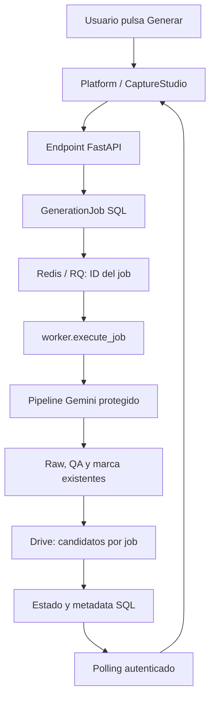

# Generación de imágenes: mapa protegido del proyecto

Lee primero este documento antes de cambiar IA, cola, archivos o despliegue.
Base aceptada: `3ba6a2f9aeb65265a6165ee6c48b7ab273256d7f`.
`test_generation_contract.py` compara el AST, no los píxeles, contra ese commit.
`creative_pipeline.py`, `studio_api.make_image`, `studio_api.creative_plan`,
`app.PROMPT_HD`, `app._validar_con_vision` y las funciones protegidas del gateway
no deben cambiar para introducir Redis o aislar RAM.

## Estado inicial auditado, antes de esta continuación

Hay dos entradas para la misma generación aceptada: captura de un producto y
lote del catálogo. No confundir un lote de publicación WooCommerce con un lote
de generación pagada. Producción antigua todavía utiliza callbacks Gradio;
su mapa está en `docs/current-image-generation-flow.md`.

| Paso | Captura Next.js | Lote del catálogo |
| --- | --- | --- |
| Botón | `CaptureStudio` en `frontend/components/CaptureStudio.tsx`; `run` | `Platform` en `frontend/app/page.tsx`; estimación y confirmación |
| Solicitud | `POST /api/generate` → `studio_api.generate_images` | `POST /api/platform/generation/estimate`, después `/generation/jobs` → `catalog_platform.api.enqueue` |
| Entrada | `slots`, `automatic_review`, borrador de sesión | IDs internos, slots, cantidad, token de estimación, request_key |
| Job inicial | `studio_api.start_job`, RAM, threads locales | una fila `GenerationJob` por producto, PostgreSQL |
| Procesamiento inicial | misma API; debe aislarse en esta etapa | `catalog_platform.queue.claim` → `worker.process` → `worker.generation` |
| Adaptador | llama `make_image` directamente | `ImageGenerationService.plan` / `generate` llaman las mismas funciones |
| Llamada IA | `creative_pipeline.generate` → `GeminiClient.models.generate_content` | exactamente el mismo pipeline |
| Resultados | IDs opacos de archivos privados `/tmp`; `studio_api.view` | `ProductImage`, `GeneratedAsset`, checksum, dimensiones y job_id |
| Guardado | aprobar → `POST /api/save` → `ProductCapture.save` | candidatos y raw en Drive; revisión y publicación separadas |
| Consulta | `GET /api/jobs/{id}` y `/api/files/{id}` | `/api/platform/jobs`, `/assets`, `/images/{id}` |

## Flujo resultante en modo separado

Requiere `STUDIO_IMAGE_JOBS=worker`, `GENERATION_QUEUE_BACKEND=rq`, PostgreSQL
y Redis; está implementado en la rama, todavía no activado en producción.

Catálogo: `api.enqueue` crea GenerationBatch y un job por producto. Captura:
`studio_api.generate_images` delega a `studio_jobs.enqueue_capture`; solo
snapshot/referencias preparatorias en API, sin llamada de imagen. Devuelve
202 con job queued. `database.transaction` confirma SQL antes de
`redis_broker.publish_one`; si falla Redis, `reconcile` entrega después.

RQ utiliza JSON y solo ID. `worker.execute_job` reclama/renueva lease y carga
la cuenta cifrada desde `accounts.load`. `worker.generation` o
`studio_jobs.process_capture` llaman a `ImageGenerationService.plan/generate`.
Todo el pipeline descrito abajo permanece igual. Descarga por chunks, checksum
por chunks y limpieza de namespace `/tmp` no alteran prompt ni composición.

Resultados se suben a `imagenes_temporales/<job_id>` con nombre canónico;
sample 1 no agrega sufijo, samples posteriores usan `_2`, etc. Catálogo guarda
ProductImage/GeneratedAsset; captura conserva SKU/revisión/IDs/raw/QA/checksum
en el payload SQL. Al reiniciar API, nuevo login y `recover_latest`/`restore`
recuperan los IDs. Aprobación y estado de guardado de captura también se persisten.

Guardar una imagen aprobada en catálogo usa `/api/platform/assets/{id}/save`
→ `worker.save_asset` → `DriveService.save_approved`. Captura mantiene
`ProductCapture.save`, con la subida delegada a esa frontera en modo worker.
Backup previo y detección de duplicados protegen el canónico; no hay publicación
automática. La UI permite regenerar otro candidato conservando el anterior.

El fallback `STUDIO_IMAGE_JOBS=local` conserva la modalidad previa. No equivale
a cumplir aislamiento RAM. Análisis de texto y guardado compatible todavía
usan jobs locales; la generación/corrección de imágenes usa worker con el flag.

## Pipeline, función por función

1. `session` valida Google y prepara un namespace privado. `draft` exige un
   producto capturado; `ready` exige la clave configurada. SKU y nombre se
   validan antes de una llamada pagada.
2. `creative_plan` carga `creative_pipeline.load_style_examples`: máximo dos
   referencias comerciales de la carpeta existente. Son referencias de estilo;
   las fotos originales determinan identidad, empaque, marca y sabor.
3. `creative_pipeline.plan_key` identifica producto y referencias. El brief se
   conserva para evitar investigar otra vez al corregir el mismo producto.
4. `creative_pipeline.brief` utiliza el modelo de texto actual y Google Search
   para escenas lifestyle/comercial. `grounding` conserva fuentes. El fallback
   actual se preserva cuando no está disponible la investigación.
5. `ImageGenerationService.generate` llama `studio_api.make_image`.
   `creative_pipeline.generate` adjunta originales, estilo y raw anterior cuando
   hay correcciones. Hace una llamada por candidato, sin retry pagado oculto.
6. La validación existente exige imagen no vacía, cuadrada y al menos 1024×1024.
   `make_image` escribe raw JPEG, aplica QA opcional y marca oficial mediante
   `product_generation.branded_image`. QA no genera otra imagen automáticamente.
7. `ProductCapture.stage_image` asocia SKU, slot y revisión; `asset` devuelve un
   ID opaco. La ruta `/tmp` nunca se envía al navegador.
8. El catálogo almacena solo metadata SQL; Drive guarda archivos. Los servicios
   no comparten filesystem. Un worker descarga sus propias referencias y borra
   su namespace temporal al terminar.
9. Aprobación, guardado y publicación son acciones distintas. Ningún resultado
   generado se envía a WooCommerce sin aprobación explícita.

## Corrección y regeneración

`POST /api/images/{slot}/correct` → `studio_api.correct_image` recoge feedback y
errores seleccionados. `make_image` acumula hasta ocho correcciones y adjunta el
raw anterior, sin duplicar su marca. Un error conserva la imagen previa.
El catálogo usa `/api/platform/assets/{id}/correct` → `api.correct`: crea un job
nuevo ligado a `previous_asset_id` y `previous_raw_id`; el asset previo permanece.
Regenerar debe crear otro candidato con los originales, sin sobrescribir el
resultado anterior ni reejecutar el lote completo.

## Variables y conexiones externas

| Configuración | Consumidor | Uso |
| --- | --- | --- |
| `GEMINI_IMAGE_MODEL` | `creative_pipeline.IMAGE_MODEL` | modelo actual; no cambiar durante migración |
| `GEMINI_TEXT_MODEL` | `creative_pipeline.TEXT_MODEL` | investigación creativa existente |
| clave Gemini de sesión / `AI_API_KEY` | `GeminiClient`, contexto de catálogo | solo servidor |
| `GOOGLE_CLIENT_ID`, `_SECRET`, `_REDIRECT_URI` | `app.py`, OAuth Google | autenticación y renovación |
| `GOOGLE_DRIVE_FOLDER_ID` | descubrimiento de Drive | `Proyecto_IA`, no una carpeta nueva inventada |
| `DATABASE_URL` | `catalog_platform.database` | estado durable y relaciones |
| `CREDENTIAL_ENCRYPTION_KEY` | `accounts.persist` / `load` | conexión cifrada para worker autónomo |
| `REDIS_URL` | broker RQ en la etapa nueva | transportar IDs, no imágenes ni claves |
| `IMAGE_WORKER_CONCURRENCY` | supervisor del worker nuevo | procesos simultáneos, iniciar en 1 |

Llamadas externas: OAuth/token Google, Drive files/media, Sheets values,
Google GenAI y su herramienta Search. WordPress/WooCommerce se usan solo en
publicación posterior, no para producir la imagen.

## Drive y naming que debe conservarse

Raíz verificada: `Proyecto_IA` (`1WNDrC4rMfeg066uciiS5VVOYuTvqoAPT`).
Generadas: `imagenes_generadas` (`1V4HgnTCRnwVGwrGD968eNdtvQDGGY7wt`).
Temporales existentes: `imagenes_temporales` (`1HHe116AZFECvkvqy0bGJsXNKLvfw4bPL`).

Nombres finales compatibles: `<SKU>_1_hd.jpg`, `<SKU>_2_uso.jpg`,
`<SKU>_3_comercial.jpg`; nombres anteriores `_1.png`, `_2.png`, `_3.png` siguen
siendo válidos. No se renombra ni elimina ningún archivo histórico.
Los candidatos múltiples necesitan un ID de job para distinguir revisiones:
esa relación debe vivir en metadata o una carpeta temporal por job, no cambiar
el nombre canónico que consumen los resolutores existentes.

## Estado, recuperación y errores

Un job atraviesa `queued → processing → completed/failed`. Sus assets después
pueden estar `approved`, `rejected` o `published`. El lote contiene jobs por
producto; un fallo no borra los éxitos. `completed_keys` evita repetir imágenes.
Antes de llamar al proveedor se registra `in_flight`. Si el proceso muere sin
confirmar el resultado, se exige revisión; no se gasta otra imagen automáticamente.
El lease identifica al worker dueño; debe renovarse también durante llamadas
largas. El resultado y checkpoint se confirman en la misma transacción SQL.

## Pruebas requeridas antes y después de cada modificación

`test_generation_contract.py`: funciones y prompts intactos.
`test_creative_pipeline.py`: referencias, grounding, raw previo, formato y no
reintentos. `test_studio_api.py`: HTTP, permisos, slots, corrección y aprobación.
`test_catalog_platform.py`: crear/procesar job, JPEG no vacío, 1024², checksum,
producto/job/asset, Drive, recuperación, duplicados y error registrado.
`test_stabilization.py` cubre Redis/RQ real, entrega idempotente/post-commit,
caída del broker, rollback SQL, naming, captura/corrección/recuperación,
aprobación durable, backup, limpieza temporal y fallo incierto sin nuevo cobro.
Las pruebas con proveedor simulado verifican comportamiento, no disponibilidad
ni calidad de Gemini. El pase real se registra siguiendo `TEST_PLAN.md`.
